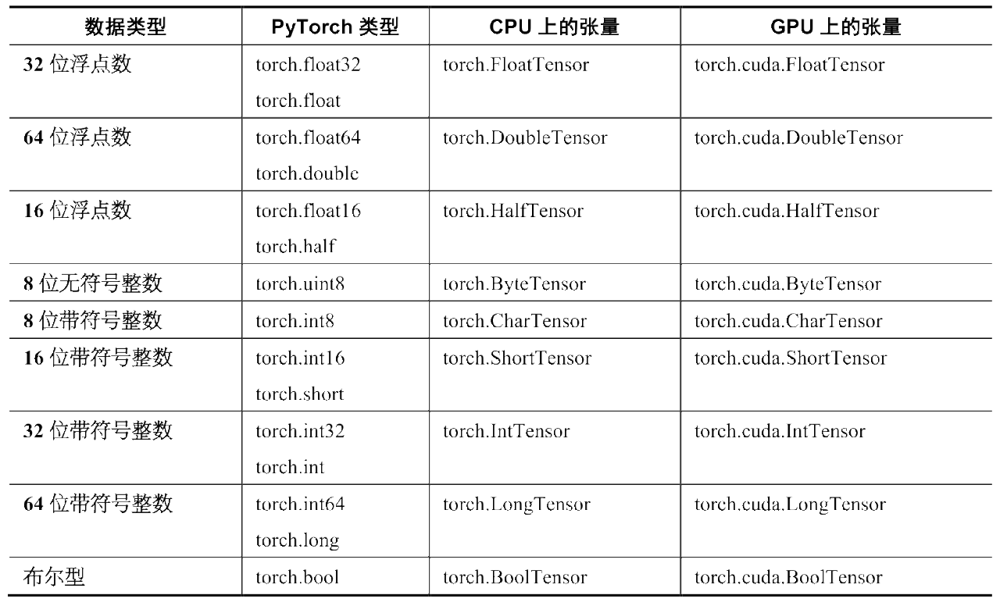
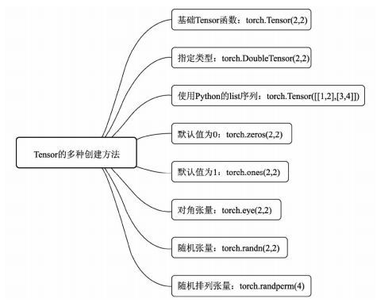
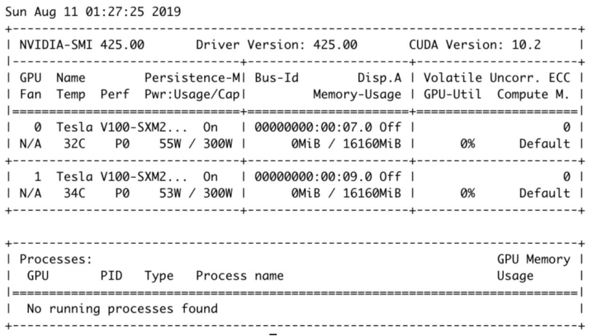
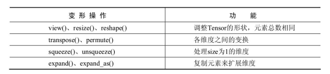
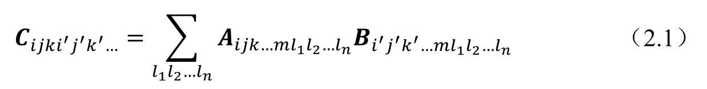
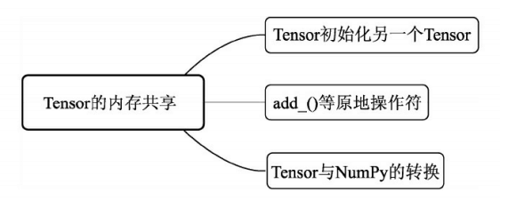

### 1. 张量的数据类型
PyTorch中的张量一共支持9种数据类型， 每种数据类型都对应CPU和GPU的两种子类型。其中，16位半精度浮点是专为GPU上运行的模型设计的，以尽可能地节省GPU显存占用，但这种节省显存空间的方式也缩小了所能表达数据的大小。**PyTorch中默认的数据类型是 torch.FloatTensor**，即torch.Tensor等同于torch.FloatTensor。


需要注意的是，**现阶段PyTorch并不支持复数类型**，如果有用到的场合(如使用torch.fft/torch.ift进行快速傅里叶变换)，需要使用张量的两个分量来分别模拟复数的实部和虚部。`在PyTorch的不同类型之间，可以通过调用to方法进行转换，该方法传入的参数是转换目标类型`

### 2.张量的创建

```python
import numpy as np
import torch

torch.Tensor(2, 4)
Out[3]: 
tensor([[1.3733e-14, 1.2102e+25, 1.6992e-07, 2.9599e+21],
        [2.8175e+20, 1.7566e+25, 1.7748e+28, 7.7562e+26]])

torch.DoubleTensor(2, 4)  # 指定数据类型生成张量
Out[4]: 
tensor([[1.9534e+233, 5.6187e-310,  0.0000e+00, 7.4110e-323],
        [1.2886e-311, 1.2886e-311, 6.3660e-314, 4.9407e-324]],
       dtype=torch.float64)

torch.tensor([[1, 2],[2,3]])  # 将列表转换成张量
Out[5]: 
tensor([[1, 2],
        [2, 3]])

torch.tensor(range(10))  # 转换迭代器为张量
Out[6]: tensor([0, 1, 2, 3, 4, 5, 6, 7, 8, 9])

torch.tensor(np.array([1,2,3,4]))  # 转换numpy数组为张量
Out[7]: tensor([1, 2, 3, 4], dtype=torch.int32)

torch.rand(3, 3)   # 生成3x3的矩阵，矩阵元素服从[0,1)的均匀分布
Out[8]: 
tensor([[0.3348, 0.1000, 0.0576],
        [0.1141, 0.6428, 0.0758],
        [0.7652, 0.7955, 0.6914]])

torch.randn(4, 4)  # 生成4x4的张量，张量元素服从标准正态分布，即mean=0，std=1
Out[9]: 
tensor([[-1.1834,  0.8358, -0.0113, -2.3396],
        [-0.9476, -1.6578,  0.9154,  0.0084],
        [-0.6096,  0.7943,  0.6744, -0.9262],
        [-1.6344, -1.1811,  0.6366,  0.9412]])

torch.zeros(2, 3, 4)  # 生成2x3x4的张量，张量元素为0
Out[10]: 
tensor([[[0., 0., 0., 0.],
         [0., 0., 0., 0.],
         [0., 0., 0., 0.]],

        [[0., 0., 0., 0.],
         [0., 0., 0., 0.],
         [0., 0., 0., 0.]]])

torch.ones(2, 3, 1)  # 生成2x3x1的张量，张量元素为1
Out[11]: 
tensor([[[1.],
         [1.],
         [1.]],

        [[1.],
         [1.],
         [1.]]])

torch.eye(2)  # 生成2x2的单位矩阵
Out[12]: 
tensor([[1., 0.],
        [0., 1.]])

torch.randint(0,10,(3,3))  # 0~10(不含)之间均匀分布整数的3x3的矩阵
Out[13]: 
tensor([[8., 8., 9.],
        [4., 2., 5.],
        [2., 9., 3.]])

torch.randperm(4)  # 生成0~4(不含)的数字并随机排序
Out[14]: tensor([3, 0, 1, 2])
```
还有两种方法，比较少用，一种是`已知某一张量，创建和已知张量相同形状的张量`，另一种是`已知张量的数据类型, 创建一个形状不同但数据类型相同的新张量`
```python
t = torch.randn(4, 5)

torch.zeros_like(t)
Out[19]: 
tensor([[0., 0., 0., 0., 0.],
        [0., 0., 0., 0., 0.],
        [0., 0., 0., 0., 0.],
        [0., 0., 0., 0., 0.]])

torch.randn_like(t)
Out[20]: 
tensor([[ 0.0533, -0.5395,  0.2987, -0.5263,  1.0392],
        [-0.8071, -1.3988,  0.2388, -0.3015, -1.4453],
        [-0.7848, -0.6579, -0.0660, -0.2144, -0.2603],
        [-0.8858, -1.5140, -0.7397,  0.3588, -0.8318]])

t.new_tensor([1,2,3])
Out[21]: tensor([1., 2., 3.])

t.new_tensor([1,2,3]).dtype
Out[22]: torch.float32

t.new_ones(3,3)
Out[23]: 
tensor([[1., 1., 1.],
        [1., 1., 1.],
        [1., 1., 1.]])
```
另外需要注意的一点是,`没有类似于new_rand和new_ randn的函数`，所以不能用这种方法生成随机元素填充的张量。
### 3. 张量的存储
PyTorch张量可以在两种设备上存储，即CPU和GPU。在没有指定设备的时候，**PyTorch会默认存储张量到CPU上**。如果想转移张量到GPU上,则需要指定张量转移到GPU设备。一般来说, GPU设备在PyTorch上
以cuda : 0，cuda: 1 ......指定,其中数字代表的是GPU设备的编号，如果一台机器上有N个GPU ,则GPU设备的编号分别为0 , 1，
N-1。 GPU设备的详细信息可以使用`nvidia-smi`命令查看。这是`nvidia-smi`命令显示的结果，图中是两张Tesla V00显卡，编号分别是0和1

在初始化张量时，可以在创建张量的函数的参数中指定`device参数`(如
device="cpu"，或者device= "cuda : 0",
device="cuda : 1", ... )来指定张量存储的位置
```python
import torch # 导入torch包
torch.randn(3, 3, device="cpu") # 获取存储在CPU上的一个张量
torch.randn(3, 3, device="cuda:0") # 获取存储在0号GPU上的一个张量
torch.randn(3, 3, device="cuda:1") # 获取存储在1号GPU上的一个张量
torch.randn(3, 3, device="cuda:1").device # 获取当前张量的设备
torch.randn(3, 3, device="cuda:1").cpu().device # 张量从1号GPU转移到CPU
torch.randn(3, 3, device="cuda:1").cuda(1).device # 张量保持设备不变
torch.randn(3, 3, device="cuda:1").cuda(0).device # 张量从1号GPU转移到0号GPU
torch.randn(3, 3, device="cuda:1").to("cuda:0").device # 张量从1号GPU转移到0号GPU
```
从代码也可以看出，如果想将一个设备上的张量转移到另外一个设备上，有以下几种方法。首先可以`使用cpu方法把张量转移到CPU上`,其次可以`使用cuda方法把张量转移到GPU上`，其中需要传入具体的GPU的设备编号。也可以`使用to方法把张量从一个设备转移到另一个设备`, 该方法的参数是目标设备的名称(可以是字符串名称，也可以是torch.device实例)。
**需要注意的一点是,两个或多个张量之间的运算只有在相同设备上才能进行(都在CPU上或者在同一
个GPU上)，否则会报错。**

### 4. Tensor的组合与分块

组合操作是指将不同的Tensor叠加起来，主要有torch.cat()和 torch.stack()两个函数。`cat即concatenate的意思，是指沿着已有的数据的 某一维度进行拼接，操作后数据的总维数不变，在进行拼接时，除了拼 接的维度之外，其他维度必须相同`。而`torch.stack()函数指新增维度，并 按照指定的维度进行叠加`
```python
import torch
a = torch.randperm(10)
a = a.reshape([2, 5])
b = torch.Tensor([[10, 11, 15, 12, 13], [5, 4, 3, 2, 1]])
a = a.type_as(b)  # 将a,b数据类型转换一致
c = a + b # 不转换数据类型，print(a+b)会报错

torch.cat([a,b])
# torch.cat([a,b], 0)
Out[25]: 
tensor([[ 6.,  9.,  8.,  1.,  4.],
        [ 5.,  2.,  3.,  0.,  7.],
        [10., 11., 15., 12., 13.],
        [ 5.,  4.,  3.,  2.,  1.]])


torch.cat([a,b],1)
Out[26]: 
tensor([[ 6.,  9.,  8.,  1.,  4., 10., 11., 15., 12., 13.],
        [ 5.,  2.,  3.,  0.,  7.,  5.,  4.,  3.,  2.,  1.]])

# 以第0维进行stack，叠加的基本单位为序列本身，即a与b，因此输出[a, b]，
torch.stack([a,b], 0)
Out[27]: 
tensor([[[ 6.,  9.,  8.,  1.,  4.],
         [ 5.,  2.,  3.,  0.,  7.]],

        [[10., 11., 15., 12., 13.],
         [ 5.,  4.,  3.,  2.,  1.]]])

# 以第1维进行stack，叠加的基本单位为每一行
torch.stack([a,b], 1)
Out[28]: 
tensor([[[ 6.,  9.,  8.,  1.,  4.],
         [10., 11., 15., 12., 13.]],

        [[ 5.,  2.,  3.,  0.,  7.],
         [ 5.,  4.,  3.,  2.,  1.]]])

# 以第2维进行stack，叠加的基本单位为每一行的每一个元素
torch.stack([a,b], 2)
Out[29]: 
tensor([[[ 6., 10.],
         [ 9., 11.],
         [ 8., 15.],
         [ 1., 12.],
         [ 4., 13.]],

        [[ 5.,  5.],
         [ 2.,  4.],
         [ 3.,  3.],
         [ 0.,  2.],
         [ 7.,  1.]]])
```
分块则是与组合相反的操作，指将Tensor分割成不同的子Tensor， 主要有torch.chunk()与torch.split()两个函数，前者需要指定分块的数量， 而后者则需要指定每一块的大小，以整型或者list来表示。
```python
a = torch.Tensor([[1,2,3],[4,5,6]])

# 使用chunk，沿着第0维进行分块，一共分两块，因此分割成两个1×3的Tensor
torch.chunk(a,2,0)
Out[30]: (tensor([[1., 2., 3.]]), tensor([[4., 5., 6.]]))
# 沿着第1维进行分块，因此分割成两个Tensor，当不能整除时，最后一个的维数会小于前面的,因此第一个Tensor为2×2，第二个为2×1
torch.chunk(a,2,1)
Out[30]: 
(tensor([[1., 2.],
         [4., 5.]]),
 tensor([[3.],
         [6.]]))
# 使用split，沿着第0维分块，每一块维度为2，由于第一维维度总共为2，因此相当于没有分割
torch.split(a,2,0)
Out[31]: 
(tensor([[1., 2., 3.],
         [4., 5., 6.]]),)
# 沿着第1维分块，每一块维度为2，因此第一个Tensor为2×2，第二个为2×1
torch.split(a,2,1)
Out[32]: 
(tensor([[1., 2.],
         [4., 5.]]),
 tensor([[3.],
         [6.]]))
# split也可以根据输入的list进行自动分块，list中的元素代表了每一个块占的维度
torch.split(a,[1,2],1)
Out[33]: 
(tensor([[1.],
         [4.]]),
 tensor([[2., 3.],
         [5., 6.]]))
```

### 5. Tensor的维度与变形
获取维度有以下个主要的方法，具体如下：
```python
n [9]: t = torch.rand(3, 5, 2)

t.ndimension()  # 获取维度的数目
Out[10]: 3

t.nelement()  # 获取该张量的总元素数目
Out[11]: 30

t.size()  # 获取该张量每个维度的大小，调用方法
Out[12]: torch.Size([3, 5, 2])

t.shape  # 获取该张量每个维度的大小，访问属性
Out[13]: torch.Size([3, 5, 2])
```
变形操作则是指改变Tensor的维度，以适应在深度学习的计算中， 数据维度经常变换的需求。

其中，view方法并view不改变张量底层的数据，只是改变维度步长的信息。
另外如果需要重新生成一个张量(复制底层数据)，则需要调用`contiguous方法`，调用这个方法的时候,如果张量的形状和初始维度形状的信息兼容(蒹容的定义是新张量的两个连续维度的乘积等于
原来张量的某一维度) , 则会返回当前张量，否则会根据当前维度形状信息和数据重新生成一个形状信息兼容的张量,并且返回新的张量。为了验证这点，可以使用`data._ptr方法`来获取当前数据的指针,如果指针发生变化,则张量的数据得到重新分配。
可以看到,当张量为长度12的向量时,调用view方法变成3x4和4x3不影响数据的地址。但是，当引入transpose方法的时候(这个方法用于交换两个维度的步长,相当于在这两个维度做了转置，具有同样作用的方法有permute, 用于交换多个维度的步长) , `返回的新张量虽然还是共享底层的数据指针, 但是维度和步长不再兼容(即形状信息不再兼容)， 需要通过调用contiguous方法, 才能生成一个新的张量`。

```python
t = torch.randn(12) # 产生大小为12的向量
t
Out[21]: 
tensor([ 0.0896,  1.0056, -2.5203, -0.1784,  2.7716, -1.1744, -0.5075,  0.7522,
        -1.2022,  0.1893,  1.8665,  1.1510])

t.data_ptr() # 获取张量的数据指针
Out[22]: 102178768

t.view(3,4)  # 维度大小的乘积要等于张量的元素数目（即3*4 = t.nelement()，否则会报错）
Out[23]: 
tensor([[ 0.0896,  1.0056, -2.5203, -0.1784],
        [ 2.7716, -1.1744, -0.5075,  0.7522],
        [-1.2022,  0.1893,  1.8665,  1.1510]])

t.view(4, 3) # 向量改变形状为4×3的矩阵

Out[24]: 
tensor([[ 0.0896,  1.0056, -2.5203],
        [-0.1784,  2.7716, -1.1744],
        [-0.5075,  0.7522, -1.2022],
        [ 0.1893,  1.8665,  1.1510]])

t.view(-1, 4) # 第一个维度为-1，PyTorch会自动计算该维度的具体值

Out[25]: 
tensor([[ 0.0896,  1.0056, -2.5203, -0.1784],
        [ 2.7716, -1.1744, -0.5075,  0.7522],
        [-1.2022,  0.1893,  1.8665,  1.1510]])

t.data_ptr()  # 获取张量的数据指针
Out[26]: 102178768

t # view方法不改变底层数据，只是改变维度的步长信息
Out[27]: 
tensor([ 0.0896,  1.0056, -2.5203, -0.1784,  2.7716, -1.1744, -0.5075,  0.7522,
        -1.2022,  0.1893,  1.8665,  1.1510])

t.view(4, 3)[0, 0] = 2.0  # 这个不明显，可以看下面那个

t
Out[28]: 
tensor([ 2.0000,  1.0056, -2.5203, -0.1784,  2.7716, -1.1744, -0.5075,  0.7522,
        -1.2022,  0.1893,  1.8665,  1.1510])
t.view(4,3)[1,0] = 2

t
Out[29]: 
tensor([ 2.0000,  1.0056, -2.5203,  2.0000,  2.7716, -1.1744, -0.5075,  0.7522,
        -1.2022,  0.1893,  1.8665,  1.1510])

t.data_ptr() # 获取张量的数据指针
Out[30]: 102178768

t.view(3,4).data_ptr() # 数据指针不改变
Out[31]: 102178768

t.view(4,3).data_ptr() # 同上，不改变
Out[32]: 102178768

t.view(3,4).contiguous().data_ptr() # 同上，不改变
Out[33]: 102178768

t.view(4,3).contiguous().data_ptr() # 同上，不改变
Out[34]: 102178768

t.view(3,4).transpose(0, 1).data_ptr() # transpose方法交换两个维度的步长
Out[35]: 102178768

t.view(3,4).transpose(0,1).contiguous().data_ptr() # 步长和维度不兼容，重新生成张量，指针指向发生了改变
Out[36]: 102177552
```
* view()、resize()和reshape()函数
view()、resize()和reshape()函数可以在不改变Tensor数据的前提下任意改变Tensor的形状，必须保证调整前后的元素总数相同，并且`调整前后共享内存，三者的作用基本相同`。
但是在大多数情况下, PyTorch的张量在改变形状的时候不需要调contiguous，在某些情况下, 如调用view方法以后再调transpose方法和一个与初始张量形状不兼容的view方法，会在transpose方法后加contiguous方法的调用。在这种情况下，可以直接调用reshape方法, 该方法会在形状信息不兼容的时候自动生成一个新的张量, 并自动复制原始
张量的数据。也就是说，`reshape()操可以看做是Tensor.contiguous().view()作`。

```python
a= torch.arange(1,10)

a
Out[36]: tensor([1, 2, 3, 4, 5, 6, 7, 8, 9])

a.data_ptr()
Out[37]: 100862672

b = a.view(3,3)

b.data_ptr()
Out[40]: 100862672
# 从输出可以看出，b指向了a

c = a.resize(3,3)
UserWarning: non-inplace resize is deprecated warnings.warn("non-inplace resize is deprecated")

c.data_ptr()
Out[42]: 100862672
# 从输出可以看出，c指向了a

d = a.reshape(3, 3)

d.data_ptr()
Out[45]: 100862672
# 从输出可以看出，d也指向了a

# 改变了b、c、d的一个元素，a也跟着改变了，说明两者共享内存
b[0,0] = -1
c[2,0] = 0
d[0,1] = 5

a
Out[49]: tensor([-1,  5,  3,  4,  5,  6,  0,  8,  9])
```
当然，如果想原地直接改变Tensor的尺寸，可以使用resize_()的原地操作函 数。
```python
e = a.resize_(3,3)

e
Out[52]: 
tensor([[-1,  5,  3],
        [ 4,  5,  6],
        [ 0,  8,  9]])
```
* transpose()和permute()函数
transpose()函数可以将指定的两个维度的`元素进行转置`(只能操作2D)，而permute()函数则可以按照给定的维度进行`维度变换`。
```python
m = torch.arange(8)

m
Out[63]: tensor([0, 1, 2, 3, 4, 5, 6, 7])

m.reshape(2,2,2)
Out[64]: 
tensor([[[0, 1],
         [2, 3]],

        [[4, 5],
         [6, 7]]])

m
Out[65]: tensor([0, 1, 2, 3, 4, 5, 6, 7])

m = m.reshape(2,2,2)

m
Out[67]: 
tensor([[[0, 1],
         [2, 3]],

        [[4, 5],
         [6, 7]]])

# 将第0维和第1维的元素进行转置
m.transpose(0,1)
Out[68]: 
tensor([[[0, 1],
         [4, 5]],

        [[2, 3],
         [6, 7]]])


x = torch.randn(2,3,5)
x
Out[72]: 
tensor([[[-1.6811, -0.0937, -0.0710,  0.0253,  0.3153],
         [-0.6646,  0.8209,  0.0853, -0.2636,  0.1395],
         [ 0.4830, -0.0842, -0.7115,  0.2688, -0.1725]],

        [[-1.1283,  0.6603,  0.9406, -1.8296,  0.7914],
         [-0.0274, -0.4492,  0.6564, -1.1954,  1.9778],
         [-0.5098,  1.1601,  1.5089, -2.2842, -1.0767]]])

x.permute(2,1,0)
Out[73]: 
tensor([[[-1.6811, -1.1283],
         [-0.6646, -0.0274],
         [ 0.4830, -0.5098]],

        [[-0.0937,  0.6603],
         [ 0.8209, -0.4492],
         [-0.0842,  1.1601]],

        [[-0.0710,  0.9406],
         [ 0.0853,  0.6564],
         [-0.7115,  1.5089]],

        [[ 0.0253, -1.8296],
         [-0.2636, -1.1954],
         [ 0.2688, -2.2842]],

        [[ 0.3153,  0.7914],
         [ 0.1395,  1.9778],
         [-0.1725, -1.0767]]])

x.permute(2,1,0).size()
Out[74]: torch.Size([5, 3, 2])
```
* squeeze()和unsqueeze()函数
squeeze()函数用于去除size为1的维度，unsqueeze()函数则是将指定的维度的size变为1。
```python
a = torch.arange(1,10)
# 将第0维变为1，因此总的维度为1、9
a.unsqueeze(0).shape
Out[79]: torch.Size([1, 9])

a.unsqueeze(0)
Out[80]: tensor([[1, 2, 3, 4, 5, 6, 7, 8, 9]])

a.shape
Out[81]: torch.Size([9])
# 第0维如果是1，则去掉该维度，如果不是1则不起任何作用
a.squeeze(0)
Out[82]: tensor([1, 2, 3, 4, 5, 6, 7, 8, 9])

a = a.unsqueeze(0)
a
Out[83]: tensor([[1, 2, 3, 4, 5, 6, 7, 8, 9]])

a.squeeze(0)
Out[84]: tensor([1, 2, 3, 4, 5, 6, 7, 8, 9])
```
* 扩增：expand()和expand_as()函数
expand()函数将size为1的维度复制`扩展`为指定大小，也可以使用expand_as()函数指定为示例Tensor的维度。
```python
a = torch.randn(2,2,1)

a
Out[85]: 
tensor([[[ 0.0435],
         [-1.1947]],

        [[-1.1904],
         [ 2.2401]]])

a.expand(2,2,5)
Out[86]: 
tensor([[[ 0.0435,  0.0435,  0.0435,  0.0435,  0.0435],
         [-1.1947, -1.1947, -1.1947, -1.1947, -1.1947]],

        [[-1.1904, -1.1904, -1.1904, -1.1904, -1.1904],
         [ 2.2401,  2.2401,  2.2401,  2.2401,  2.2401]]])

a
Out[87]: 
tensor([[[ 0.0435],
         [-1.1947]],

        [[-1.1904],
         [ 2.2401]]])
```
注意：在进行Tensor操作时，有些操作如transpose()、permute()等 可能会把Tensor在内存中变得不连续，而有些操作如view()等是需要 Tensor内存连续的，这种情况下需要使用contiguous()操作先将内存变为连续的
### 6. Tensor的切片和索引
索引操作与NumPy非常类似，主要包含`下标索引、表达式索引`、使用torch.where()与Tensor.clamp()的选择性索引。
```python
a = torch.tensor([[1., 2., 3.],
        [4., 5., 6.]])
a
Out[35]: 
tensor([[1., 2., 3.],
        [4., 5., 6.]])

a[:,1]
Out[36]: tensor([2., 5.])

# 改变a某些元素的值
a[0,1] = 0
a[1,1] = -1

a
Out[37]: 
tensor([[ 1.,  0.,  3.],
        [ 4., -1.,  6.]])

a>0
Out[38]: 
tensor([[1, 0, 1],
        [1, 0, 1]], dtype=torch.uint8)

a[a>0]  # 等价于torch.masked_select(a, a>0)
Out[39]: tensor([1., 3., 4., 6.])

torch.nonzero(a)  # 选择非0元素的坐标，并返回
Out[40]: 
tensor([[0, 0],
        [0, 2],
        [1, 0],
        [1, 1],
        [1, 2]])

# torch.where(condition, x, y)，满足condition的位置输出x，否则输出
torch.where(a>1, torch.full_like(a, 1), a)
Out[41]: 
tensor([[ 1.,  0.,  1.],
        [ 1., -1.,  1.]])

# 对Tensor元素进行限制可以使用clamp()函数，eg：限制最小值为1，最大值为2
a.clamp(1, 2)
Out[42]: 
tensor([[1., 1., 2.],
        [2., 1., 2.]])
```
### 7. Tensor的排序与取极值
```python
a = torch.randperm(12)
a
Out[97]: tensor([ 5,  7,  6, 11,  9,  3,  2,  0,  1, 10,  4,  8])

a = a.reshape(3, 4)

a
Out[99]: 
tensor([[ 5,  7,  6, 11],
        [ 9,  3,  2,  0],
        [ 1, 10,  4,  8]])
# 按照第0维即按行排序，每一列进行比较，True代表降序，False代表升序
a.sort(0, True)
Out[101]: 
(tensor([[ 9, 10,  6, 11],
         [ 5,  7,  4,  8],
         [ 1,  3,  2,  0]]), tensor([[1, 2, 0, 0],
         [0, 0, 2, 2],
         [2, 1, 1, 1]]))

a.sort(0, True)[0]
Out[100]: 
tensor([[ 9, 10,  6, 11],
        [ 5,  7,  4,  8],
        [ 1,  3,  2,  0]])

# 按照第0维即按行选取最大值，将每一列的最大值选取出来
a.max(0)
Out[102]: (tensor([ 9, 10,  6, 11]), tensor([1, 2, 0, 0]))

torch.argmax(a,0)
Out[103]:tensor([1, 2, 0, 0]))

torch.max(a,0)[1]
Out[104]:tensor([1, 2, 0, 0]))

a.min(0)
Out[105]: (tensor([1, 3, 2, 0]), tensor([2, 1, 1, 1]))

a.min(1)
Out[106]: (tensor([5, 0, 1]), tensor([0, 3, 0]))

a.argmin(1)  # torch.argmin(1)
Out[107]: tensor([0, 3, 0]))
```
### 8. Tensor的运算
对于Tensor的单元素数学运算，如abs()、sqrt()、log()、pow()和三角函数等，都是逐元素操作（element-wise），输出的Tensor形状与原始 Tensor形状一致
对于类似求和、求均值、求方差、求距离等需要多个元素完成的操作，往往需要沿着某个维度进行计算，在Tensor中属于归并操作，输出形状小于输入形状。
```python
import torch

t1 = torch.rand(3, 4) # 产生一个3×4的张量

t1
Out[3]: 
tensor([[0.2661, 0.8040, 0.5565, 0.8184],
        [0.5466, 0.5124, 0.5853, 0.7607],
        [0.3673, 0.2382, 0.1769, 0.3290]])

t1.sqrt()  # 对每个元素都求平方根
Out[4]: 
tensor([[0.5159, 0.8967, 0.7460, 0.9046],
        [0.7393, 0.7158, 0.7650, 0.8722],
        [0.6060, 0.4880, 0.4206, 0.5736]])

torch.sqrt(t1)
Out[5]: 
tensor([[0.5159, 0.8967, 0.7460, 0.9046],
        [0.7393, 0.7158, 0.7650, 0.8722],
        [0.6060, 0.4880, 0.4206, 0.5736]])

t1  # 前两个操作不改变张量的值
Out[6]: 
tensor([[0.2661, 0.8040, 0.5565, 0.8184],
        [0.5466, 0.5124, 0.5853, 0.7607],
        [0.3673, 0.2382, 0.1769, 0.3290]])

t1.sqrt_()  # 平方根原地操作
Out[7]: 
tensor([[0.5159, 0.8967, 0.7460, 0.9046],
        [0.7393, 0.7158, 0.7650, 0.8722],
        [0.6060, 0.4880, 0.4206, 0.5736]])

t1 # 原地操作，改变张量的值
Out[8]: 
tensor([[0.5159, 0.8967, 0.7460, 0.9046],
        [0.7393, 0.7158, 0.7650, 0.8722],
        [0.6060, 0.4880, 0.4206, 0.5736]])

torch.sum(t1) # 默认对所有的元素求和
Out[9]: tensor(8.2438)

torch.sum(t1, 0) # 对第0维的元素求和（这里是对每一列求和）
Out[10]: tensor([1.8612, 2.1005, 1.9316, 2.3504])

torch.sum(t1, [0,1]) # 对第0、1维的元素求和，这里等价于torch.sum(t1)
Out[11]: tensor(8.2438)

torch.sum(t1, 1)  # 对第1维的元素求和（行求和）
Out[12]: tensor([3.0631, 3.0923, 2.0883])

t1.mean()  # 对所有元素求平均
Out[13]: tensor(0.6870)

torch.mean(t1)  
Out[14]: tensor(0.6870)

t1.mean(0)  # 对第0维的元素求平均
Out[15]: tensor([0.6204, 0.7002, 0.6439, 0.7835])
```
torch.Tensor还提供了一些成员方法，使得逐元素做相同的初等运算更简单，具体如下：
>成员方法`reciprocal()`：求倒数，即1除以张量。
成员方法`sqrt()`：开平方
成员方法`rsqrt()`：先开平方，再取倒数
成员方法`addcmul()` 和成员方法`addcdiv()`
```python
t1
Out[18]: 
tensor([[0.5159, 0.8967, 0.7460, 0.9046],
        [0.7393, 0.7158, 0.7650, 0.8722],
        [0.6060, 0.4880, 0.4206, 0.5736]])

t1.add(t1)  # 等价于 t1+t1
Out[19]: 
tensor([[1.0317, 1.7933, 1.4919, 1.8093],
        [1.4786, 1.4317, 1.5301, 1.7443],
        [1.2120, 0.9760, 0.8413, 1.1473]])

t2 = torch.rand(3,4)

t2
Out[22]: 
tensor([[0.3300, 0.8613, 0.8039, 0.2490],
        [0.1884, 0.9804, 0.3942, 0.8053],
        [0.6700, 0.4259, 0.4433, 0.2229]])

t1.sub(t2)  # 等价于 t1-t1
Out[24]: 
tensor([[ 0.1858,  0.0353, -0.0579,  0.6556],
        [ 0.5508, -0.2646,  0.3708,  0.0669],
        [-0.0640,  0.0621, -0.0227,  0.3508]])

t1.mul(t2)  # 等价于t1*t2
Out[25]: 
tensor([[0.1702, 0.7723, 0.5997, 0.2253],
        [0.1393, 0.7018, 0.3016, 0.7023],
        [0.4060, 0.2078, 0.1865, 0.1278]])

t1.div(t2)  # t1/t2
Out[26]: 
tensor([[1.5631, 1.0410, 0.9280, 3.6328],
        [3.9231, 0.7301, 1.9405, 1.0830],
        [0.9045, 1.1458, 0.9489, 2.5739]])

t1.div_(t2)  # 四则运算，改变参与运算张量的值
Out[27]: 
tensor([[1.5631, 1.0410, 0.9280, 3.6328],
        [3.9231, 0.7301, 1.9405, 1.0830],
        [0.9045, 1.1458, 0.9489, 2.5739]])

t1
Out[28]: 
tensor([[1.5631, 1.0410, 0.9280, 3.6328],
        [3.9231, 0.7301, 1.9405, 1.0830],
        [0.9045, 1.1458, 0.9489, 2.5739]])
```
### 9. Tensor的矩阵乘法运算
在Python 3.5以后，@运算符号可以作为矩阵乘法的运算符号(参考Python的PEP 465标准)。因此，有几种方法来实现矩阵乘法。第一种是使用`torch.mm`函数来进行矩阵乘法( mm代表Matrix
Multiplication)， 第二种是使用`张量内置的mm方法`来进行矩阵乘法,第三种是利用`@运算符号`来实现
```python
a = torch.rand(3,4)

b = torch.rand(4,3)

a
Out[45]: 
tensor([[0.4275, 0.9378, 0.3392, 0.4881],
        [0.8063, 0.2099, 0.6275, 0.7354],
        [0.4605, 0.0783, 0.2734, 0.4500]])

b
Out[46]: 
tensor([[0.0473, 0.0761, 0.1443],
        [0.4316, 0.7657, 0.7878],
        [0.2473, 0.1933, 0.4921],
        [0.2360, 0.4267, 0.5176]])

torch.mm(a,b)
Out[47]: 
tensor([[0.6241, 1.0245, 1.2200],
        [0.4575, 0.6572, 0.9711],
        [0.2294, 0.3399, 0.4956]])

a.mm(b)
Out[48]: 
tensor([[0.6241, 1.0245, 1.2200],
        [0.4575, 0.6572, 0.9711],
        [0.2294, 0.3399, 0.4956]])

b.mm(a)
Out[49]: 
tensor([[0.1480, 0.0717, 0.1033, 0.1440],
        [1.1646, 0.6271, 0.8422, 1.1283],
        [0.4882, 0.3110, 0.3397, 0.4843],
        [0.6833, 0.3514, 0.4893, 0.6619]])

a@b
Out[50]: 
tensor([[0.6241, 1.0245, 1.2200],
        [0.4575, 0.6572, 0.9711],
        [0.2294, 0.3399, 0.4956]])

b@a
Out[51]: 
tensor([[0.1480, 0.0717, 0.1033, 0.1440],
        [1.1646, 0.6271, 0.8422, 1.1283],
        [0.4882, 0.3110, 0.3397, 0.4843],
        [0.6833, 0.3514, 0.4893, 0.6619]])

a = torch.rand(2,3,4)

b = torch.rand(2,4,3)

torch.bmm(a,b)  # （迷你）批次矩阵乘法，返回结果为2×3×3，函数形式
Out[55]: 
tensor([[[0.5878, 0.7872, 1.1069],
         [1.1911, 1.5034, 2.2442],
         [0.9988, 1.4464, 0.9742]],

        [[0.9803, 0.4750, 0.9223],
         [0.7603, 0.2850, 0.6187],
         [0.9264, 0.7963, 0.7823]]])

a.bmm(b)  # 同上乘法，内置方法形式
Out[56]: 
tensor([[[0.5878, 0.7872, 1.1069],
         [1.1911, 1.5034, 2.2442],
         [0.9988, 1.4464, 0.9742]],

        [[0.9803, 0.4750, 0.9223],
         [0.7603, 0.2850, 0.6187],
         [0.9264, 0.7963, 0.7823]]])

a@b  # 运算符号形式，根据输入张量的形状决定调用批次矩阵乘法
Out[57]: 
tensor([[[0.5878, 0.7872, 1.1069],
         [1.1911, 1.5034, 2.2442],
         [0.9988, 1.4464, 0.9742]],

        [[0.9803, 0.4750, 0.9223],
         [0.7603, 0.2850, 0.6187],
         [0.9264, 0.7963, 0.7823]]])
```
bmm函数是一个特殊的矩阵乘法。在进行深度学习的过程中，实际经常用到的是迷你批次的数据，一般来说，第一个维度是(迷你)批次的大小。因此，数据的矩阵实际上是一个(迷你)批次的矩阵,即一个三维的张量(可以看作是一个迷你批次数量矩阵叠加在一起)。在这种情况下,如果两个张量做矩阵乘法，一般情况下是沿着(迷你)批次的方向分别对每个矩阵对做乘法，最后把所有乘积的结果整合在一起。如果是大小为`b*m*k`的张量和`b*k*n`的张量相乘，那么结果应该
是一个`b*m*n`的张量。
对于更大维度的张量的乘积,往往要决定各自张量元素乘积的结果需要沿着哪些维度求和，这个操作称为`缩并`( Contraction)。这时就需要引入`爱因斯坦求和约定`( Einstein Summation Convention )，具体如下：



### 10. Tensor的自动广播机制与向量化
```python
torch.zeros(3, 4) + 5
Out[34]: 
tensor([[5., 5., 5., 5.],
        [5., 5., 5., 5.],
        [5., 5., 5., 5.]])

torch.ones(2, 3, 4) + torch.ones(4)
Out[35]: 
tensor([[[2., 2., 2., 2.],
         [2., 2., 2., 2.],
         [2., 2., 2., 2.]],

        [[2., 2., 2., 2.],
         [2., 2., 2., 2.],
         [2., 2., 2., 2.]]])
```
值得一提的是，`并不是任意两个张量都可以进行广播`。两个张量之间要进行广播，是有前提的，前提是`任一个Tensor至少有一个维度，且从尾部遍历Tensor维度时，两者维度必须相等，其中一个要么是1要么不存在`。也就是说，它们的大小必须满足以下条件：
>两个张量的维度必须都大于等于1；
>从后往前比较两个张量的大小，各大小条目都需要相同，直到任意一个张量的大小没有条目了，或者条目元素为1。

例如，大小为 (2, 3, 4) 和大小为 (1, 1, 4) 的两个张量之间可以广播，大小为 (2, 3, 4) 和大小为 (2, 1, 4) 的两个张量之间可以广播，大小为 (2, 3, 4) 和大小为 (4,) 的两个张量之间可以广播。但是，`大小为 (2, 3, 4) 和大小为 (2, 4) 的两个张量之间就不可以广播，因为从后往前看第2个条目一个是3，另一个是2，不相同`。遇到这种情况，可以参考下面的例子做处理。
假设一个张量的大小为3x4x5，另外一个张量大小为3x5,为了能够让两个张量进行四则运算，需要把第二个张量的形状展开成3x1x5，这样两个张量就能对齐。关于大小为3x4x5的张量如何和大小为3x1x5的张量进行四则运算，其定义是将3x1x5的张量沿着第二个维度复制4次，使之成为3x4x5的张量，这样这两个张量就能进行元素一一对应的计算。
```python
import torch

t1 = torch.rand(3,4,5)

t2 = torch.rand(3,5)

t1
Out[4]: 
tensor([[[0.2872, 0.0466, 0.1534, 0.3179, 0.2856],
         [0.3835, 0.7213, 0.8638, 0.0723, 0.7058],
         [0.7581, 0.4191, 0.7141, 0.7104, 0.8872],
         [0.7005, 0.4531, 0.2693, 0.4832, 0.8080]],

        [[0.3315, 0.2169, 0.4314, 0.4563, 0.7033],
         [0.1944, 0.5009, 0.8481, 0.1276, 0.1810],
         [0.8988, 0.6530, 0.6300, 0.9716, 0.9752],
         [0.5060, 0.1428, 0.5727, 0.7211, 0.5033]],

        [[0.4246, 0.8695, 0.4639, 0.4565, 0.2431],
         [0.3297, 0.0682, 0.8634, 0.3114, 0.1307],
         [0.8410, 0.9512, 0.5569, 0.0007, 0.4313],
         [0.0923, 0.5282, 0.8687, 0.9508, 0.7195]]])

t2
Out[5]: 
tensor([[0.3059, 0.8228, 0.6686, 0.8175, 0.5956],
        [0.7550, 0.5920, 0.5740, 0.8431, 0.4619],
        [0.1268, 0.6659, 0.6770, 0.4547, 0.9527]])

t1 + t2  # 直接相加会报错
Traceback (most recent call last):

  File "<ipython-input-6-5260db44d29f>", line 1, in <module>
    t1+t2

RuntimeError: The size of tensor a (4) must match the size of tensor b (3) at non-singleton dimension 1

t2 = t2.unsqueeze(1)  将指定的维度的size变为1(这里指的是将1维维度的size变为1）。

t2.shape
Out[8]: torch.Size([3, 1, 5])

t3 = t1 + t2 # 广播求和，最后结果为3×4×5的张量

t3
Out[10]: 
tensor([[[0.5931, 0.8694, 0.8220, 1.1354, 0.8812],
         [0.6894, 1.5441, 1.5324, 0.8898, 1.3014],
         [1.0640, 1.2419, 1.3827, 1.5279, 1.4828],
         [1.0064, 1.2759, 0.9379, 1.3007, 1.4036]],

        [[1.0865, 0.8090, 1.0054, 1.2994, 1.1651],
         [0.9494, 1.0929, 1.4221, 0.9707, 0.6428],
         [1.6538, 1.2450, 1.2040, 1.8147, 1.4371],
         [1.2609, 0.7349, 1.1467, 1.5642, 0.9652]],

        [[0.5514, 1.5354, 1.1409, 0.9113, 1.1957],
         [0.4565, 0.7341, 1.5404, 0.7662, 1.0833],
         [0.9678, 1.6171, 1.2339, 0.4554, 1.3839],
         [0.2191, 1.1941, 1.5457, 1.4056, 1.6722]]])
```

```python
a = torch.ones(3,1,2)

b = torch.ones(2,1)

a
Out[13]: 
tensor([[[1., 1.]],

        [[1., 1.]],

        [[1., 1.]]])

b
Out[14]: 
tensor([[1.],
        [1.]])

a + b
Out[15]: 
tensor([[[2., 2.],
         [2., 2.]],

        [[2., 2.],
         [2., 2.]],

        [[2., 2.],
         [2., 2.]]])

c = torch.ones(2,3)

b+c
Out[17]: 
tensor([[2., 2., 2.],
        [2., 2., 2.]])

a+c
Traceback (most recent call last):

  File "<ipython-input-18-e200917bc55f>", line 1, in <module>
    a+c

RuntimeError: The size of tensor a (2) must match the size of tensor b (3) at non-singleton dimension 2
```
### 11. Tensor的内存共享
PyTorch提供了一些原地操作运算，即in-place operation，`不经过复制，直接在原来的内存上进行计算`。

* 直接通过Tensor来初始化另一个Tensor，或者通过Tensor的组合、 分块、索引、变形操作来初始化另一个Tensor，则这两个Tensor共享内存。
* PyTorch对于一些操作通过加后缀“_”实现了原地操作
* Tensor与NumPy可以高效地进行转换，并且转换前后的变量共享内存。在进行PyTorch不支持的操作时，甚至可以曲线救国，将Tensor转换为NumPy类型，操作后再转为Tensor。
```python
# Tensor初始化另一个Tensor
a = torch.rand(2,3)

a
Out[39]: 
tensor([[0.7092, 0.8396, 0.5879],
        [0.1452, 0.1666, 0.4111]])

b=a

b[0,0]=-1

c = a.view(3,2)

c
Out[43]: 
tensor([[-1.0000,  0.8396],
        [ 0.5879,  0.1452],
        [ 0.1666,  0.4111]])

c[0,1]=-5

a
Out[45]: 
tensor([[-1.0000, -5.0000,  0.5879],
        [ 0.1452,  0.1666,  0.4111]])

# Tensor转为NumPy
d = a.numpy()

d
Out[47]: 
array([[-1.        , -5.        ,  0.58794504],
       [ 0.14523482,  0.1666432 ,  0.4111398 ]], dtype=float32)

# NumPy转为Tensor
m = torch.from_numpy(d)

m
Out[50]: 
tensor([[-1.0000, -5.0000,  0.5879],
        [ 0.1452,  0.1666,  0.4111]])

#Tensor转为list
d=a.tolist()

d
Out[52]: 
[[-1.0, -5.0, 0.5879450440406799],
 [0.1452348232269287, 0.1666432023048401, 0.4111397862434387]]
```