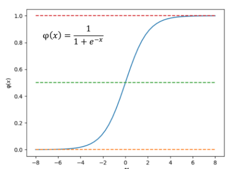
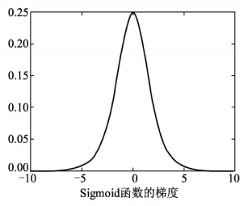
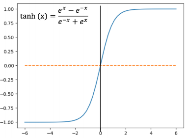
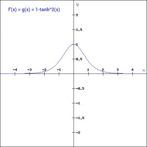
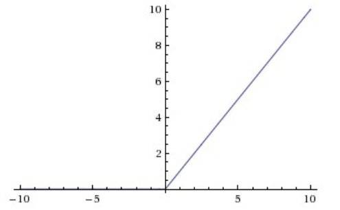
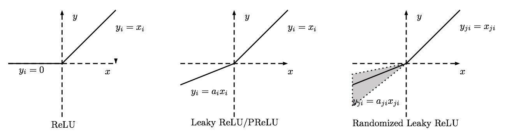

### 1. 什么是激活函数
激活函数是人工神经网络的一个极其重要的特征。它决定一个神经元是否应该被激活，激活代表神经元接收的信息与给定的信息有关。
$$Y=Activation(\sum(weight*input)+bias)$$
激活函数对输入信息进行非线性变换。 然后将变换后的输出信息作为输入信息传给下一层神经元。

**问题：可以不用激活函数吗？**
当然不行！当我们不用激活函数时，权重和偏差只会进行线性变换。线性方程很简单，但解决复杂问题的能力有限。`没有激活函数的神经网络实质上只是一个线性回归模型`。激活函数对输入进行非线性变换，使其能够学习和执行更复杂的任务。我们希望我们的神经网络能够处理复杂任务，如语言翻译和图像分类等。线性变换永远无法执行这样的任务。
`激活函数使反向传播成为可能，因为激活函数的误差梯度可以用来调整权重和偏差`。如果没有可微的非线性函数，这就不可能实现。

### 2. 常见的激活函数
常见的激活函数有：**sigmoid**；**tanh**；**ReLU**；LReLU, PReLU, RReLU；ELU（Exponential Linear Units）；softplus；softsign,softmax等

### 3. 激活函数的特性和性质
特性：
* 非线性
* 可微性
* 单调性
* f(x) ≈ x
* 输出值范围
* 计算简单
* 归一化

性质：
* 饱和
当一个激活函数h(x)满足以下条件，n趋于正无穷，称为右饱：$$\lim\limits_{n\to+\infty}h'(x)=0$$
当一个激活函数h(x)满足以下条件，n趋于负无穷，称为左饱和：$$\lim\limits_{n\to -\infty}h'(x)=0$$

`当一个激活函数，既满足左饱和又满足又饱和时，我们称之为饱和`。
* 硬饱和与软饱和
对任意的x，如果存在常数c，当$x>c$时恒有$h′(x)=0$则称其为右硬饱和，当$x < c$时恒有$h′(x)=0$则称其为左硬饱和。若既满足左硬饱和，又满足右硬饱和，则称这种激活函数为`硬饱和`。
对任意的x，如果存在常数c，当$x>c$时恒有$h′(x)$`趋近`于0，则称其为右软饱和，当$x < c$时恒有$h′(x)$趋近于0，则称其为左软饱和。若既满足左软饱和，又满足右软饱和，则称这种激活函数为`软饱和`。
### 4. sigmoid函数及其优缺点
Sigmoid函数曾被广泛地应用，也是非常经典的logic函数,但由于其自身的一些缺陷，现在已经很少用了。Sigmoid函数被定义为：
$$f(x)=\frac{1}{1+e^{-x}}$$
函数对应的图像：

从该图可以看出，Sigmoid函数是一个平滑函数，并且具有连续性和可微性。与线性函数相比，它的最大优点就是非线性。这意味着多个神经元使用Sigmoid形函数作为激活函数时，输出也是非线性的。我们来看看曲线的形状。Y轴范围是\[0,1\]，x轴在-3到3之间的梯度非常高，但在其他区域形状很平坦，这意味着在[-3，3]这个范围内，x的少量变化也将导致y值的大幅度变化。因此，函数本质上试图将y值推向极值。 当我们尝试将值分类到特定的类时，使用Sigmoid函数非常理想。
让我们来看一下Sigmoid函数的梯度。

从图中可以看出，Sigmoid函数的梯度图是平滑的，依赖于x值，这意味着在反向传播过程中，我们可以使用这个函数。误差可以被反向传播，权重也可以相应地更新。我们可以看到，这个函数在[-3，3]之外是相当平坦的。这意味着一旦x值不在[-3，3]内，梯度就变得很小，接近于零，而网络就得不到真正的学习。sigmoid函数的另一个问题是，y轴取值范围[0，1]。这个函数在原点周围不对称，得到的值都是正数。我们不希望下一个神经元得到的值在任何时候都是正值，不过可以通过缩放sigmoid函数来解决这个问题，而这需要在tanh函数中发生。

**优点**：1.Sigmoid函数的输出映射在(0,1)之间，单调连续，输出范围有限，优化稳定，可以用作输出层。2.求导容易。

**缺点**：1.由于其软饱和性，容易产生梯度消失，导致训练出现问题。输出的值域不对称，并非像tanh函数那样值域是-1到1（其输出并不是以0为中心的）

### 5. tanh函数(双曲正切函数)
tanh函数与Sigmoid函数非常相似。它实际上只是Sigmoid函数的一个放大版本。通过对 sigmoid 的平移和收缩：$$tanh(x)=2sigmoid(2x)-1$$还可以直接表示为：$$tanh(x)=\frac{2}{1+e^{-2x}}-1=\frac{1-e^{-2x}}{1+e^{-2x}}$$
Tanh函数与sigmoid函数相似，但原点对称，它的值域在[-1, 1]区间上，对应的图像是：
它基本上解决了所有值都是正数的问题，而其他属性都与sigmoid函数相同。函数具有连续性和可微性。从图中可以看出，函数是非线性的，所以我们可以很容易地将误差进行反向传播。
让我们看一下tanh函数的梯度：

与Sigmoid函数相比，tanh函数的梯度更陡。 使用sigmoid函数还是tanh函数取决于问题陈述中对梯度的要求。 但是tanh函数出现了Sigmoid函数类似的问题，梯度渐趋平坦，并且值非常低。为了解决学习缓慢和梯度消失问题，可使用其更加平缓的变体，如log-log、Softsign、Symmetrical Sigmoid等
**优点**：tanh函数将数据映射到[-1,1]，`解决了Sigmoid函数输出值域不对称问题`。它是完全可微分和反对称的，对称中心在原点。而且它比Sigmoid函数收敛速度更快。
缺点：还是没有改变Sigmoid函数的最大问题――由于饱和性产生的梯度消失。换句话说就是，`它的输出值域两头依旧过于平坦，梯度消失问题仍然存在`。

### 6. ReLU函数（修正线性单元函数）
ReLU函数是目前神经网络里常用的激活函数，公式是：
$$R(x)=max(0,x)=\left\{
\begin{aligned}
0,  \qquad x\leq0 \\
x ,  \qquad x>0 \\
\end{aligned}
\right.
$$
对应的函数图像：

**优点**：由于`ReLU函数是线性特点使其收敛速度比Sigmoid、Tanh更快，而且没有梯度饱和的情况出现`，`计算也更加高效`，相比于Sigmoid、Tanh函数，`只需要一个阈值就可以得到激活值不需要对输入归一化`来防止达到饱和。它有效缓解了梯度消失的问题。在没有无监督预训练的时候也能有较好的表现。ReLU函数不会同时激活所有的神经元，当输入的值是负的，ReLU函数会将其转换为0，而神经元不被激活。这意味着，在一段时间内，只有少量的神经元被激活，神经网络的这种稀疏性使其变得高效且易于计算。

我们来看看ReLU函数的梯度：

ReLU函数也存在着梯度为零的问题。看图可知，x＜0时，梯度是零，这意味着在反向传播过程中，权重没有得到更新。这就会产生死神经元，而这些神经元永远不会被激活。

**缺点**：随着训练的进行，`可能会出现神经元死亡`，权重无法更新的情况。如果发生这种情况，那么流经神经元的梯度从这一点开始将永远是0。也就是说，ReLU神经元在训练中不可逆地死亡了。

**扩展：ReLU变种**
当x<0时,f(x)=αx,其中α非常小,这样可以避免在x<0时,不能够学习的情况：$$ f(x)=\max(\alpha x,x)=\left\{
\begin{aligned}
\alpha x ,  \qquad x<0 \\
x ,  \qquad x\geq0 \\
\end{aligned}
\right.$$称为Parametric Rectifier(PReLU),将 α 作为可学习的参数。当 α 从高斯分布中随机产生时称为Random Rectifier（RReLU）。
当 α 固定为α=0.01时,是Leaky ReLU。（自己认为的哈，没有查证：当α=0时，其实是ReLU函数。）
`再次强调：Leaky ReLU 的α是固定的;PReLU的α不是固定的,通过训练得到;RReLU的α是从一个高斯分布中随机产生,并且在测试时为固定值。`

### 7. Leaky RuLU函数（带泄漏修正线性神经元函数）
Leaky ReLU函数只是一个ReLU函数的改良版本，它的出现是为了解决“死亡神经元”（即：x < 0时梯度为0使得该区域的神经元死亡）的问题。公式是：
$$ f(x)=\left\{
\begin{aligned}
\alpha x ,  \qquad x<0 \\
x ,  \qquad x\geq0 \\
\end{aligned}
\right.$$
在负区间内避免了直接置0，而是赋 予很小的权重，如0.01，这样可以避免在x<0时，不能够学习的情况，具体见下图：

替换水平线的主要优点是去除零梯度。在这种情况下，上图左边的梯度是非零的，所以该区域的神经元不会成为死神经元。梯度图如下：

### 8. PReLU函数
与Leaky ReLU函数类似的，还有PReLU函数，它的定义与Leaky ReLU相似。公式也是：
$$ f(x)=\left\{
\begin{aligned}
\alpha x ,  \qquad x<0 \\
x ,  \qquad x\geq0 \\
\end{aligned}
\right.$$
与Leaky ReLU函数不同的是，$\alpha$也是可训练的函数。神经网络还会学习$\alpha$的价值，以获得更快更好的收敛。 `当Leaky ReLU函数仍然无法解决死神经元问题并且相关信息没有成功传递到下一层时，可以考虑使用PReLU函数。`

### 9. Maxout函数
与常规激活函数不同的是，Maxout函数是一个可学习的`分段线性函数`，理论上可以拟合任意凸函数，与其它激活函数相比，它计算k次权值，从中`选择最大值作权值`，所以其计算量成k倍增加。`当k为2时，可看成是分成两段的线性函数`
$$f(x)=\max(w_1^Tx+b_1,w_2^Tx+b_2)$$

### 10. Softmax函数
sigmoid函数可以很容易地应用在训练过程中。然而，当你想要处理多分类问题时，他们却无能为力。简单地说，`sigmoid函数只能处理两个类，这不适用于多分类的问题。而softmax可以有效解决这个问题`。并且softmax函数很多情况都运用在神经网络中的`最后一层网络`中，使得值得区间在0,1之间，而不是二分类的。
softmax函数也是一种sigmoid函数，用于处理多类问题。它将压缩每个类在0到1之间，并除以输出总和。它实际上可以表示某个类的输入概率。其定义为：$$\delta_j=\frac{e^{Z_j}}{\sum^K_{k=1}e^{Z_j}}, \quad for \quad j=1,....K$$
其中，$Z_j$表示第$j$个类别的得分，$K$代表分类的类别总数，输出$\delta_j$为第$j$个类别的概率。
比如，我们输入[1.2,0.9,0.75]，当应用softmax函数时，得到[0.42,0.31,0.27]。现在可以用这些值来表示每个类的概率。再次强调：softmax函数最好在分类器的输出层使用。

### 11. 如何正确的选择激活函数
* 首先尝试ReLU,速度快,但要注意训练的状态。（ReLU函数是一个通用的激活函数，目前在大多数情况下使用。）
* 如果ReLU效果欠佳或者出现死神经元,尝试Leaky ReLU或Maxout等变种。
* 尝试tanh正切函数(以零点为中心,零点处梯度为1)，但是tahn函数大部分情况下效果不如ReLU和Maxout函数
* sigmoid/tanh在RNN（LSTM、注意力机制等）结构中有所应用，作为门控或者概率值。
* 在浅层神经网络中，如不超过4层的，可选择使用多种激励函数，没有太大的影响。
* 尽量避免使用Sigmoid函数
* 由于梯度消失问题，有时要避免使用sigmoid和tanh函数。
* 请记住，ReLU函数只能在隐藏层中使用，而softmax函数最好在分类器的输出层使用。

`一点经验：可以从ReLU函数开始，并注意设置好学习率；如果ReLU函数没有提供最优结果，再尝试其他激活函数。`

### 文献
[激活函数(ReLU, Swish, Maxout) ?康行天下](https://www.cnblogs.com/makefile/p/activation-function.html)
[深度学习基础篇：如何选择正确的激活函数？](https://zhuanlan.zhihu.com/p/30510596)
