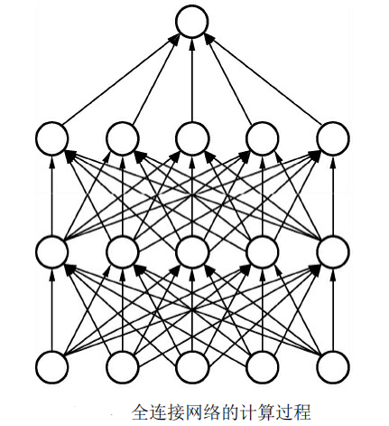

典型的 CNN 由3个部分构成：卷积层、池化层和全连接层，他们在各部分的主要作用是：
卷积层负责提取图像中的局部特征；池化层用来大幅降低参数量级(降维)和防止过拟合；全连接层类似传统神经网络的部分，用来输出想要的结果。
### 1. 卷积层――提取特征
在深度学习中使用的卷积运算通常是`离散`的。作为卷积神经网络中最基础的组成部分，`卷积的本质是利用卷积核的参数来提取数据的特征，通过矩阵点乘运算与求和运算来得到结果`。
卷积层的运算过程如下图，用一个卷积核扫完整张图片（中间那个图就是卷积核）：

再看下面这个动态图（移动中的数字组成的3*3的矩阵即是卷积核）：

这个过程我们可以理解为我们使用一个过滤器（卷积核）来过滤图像的各个小区域，从而得到这些小区域的特征值。

具体计算过程如下：下图所示为一个基本二维卷积的运算过程，公式为$y=ωx+b$。这 里的特征图（x）大小为1×5×5，即输入通道数为1，卷积核（ω）的大 小为3×3，偏置（b）为1，为保证输出维度和输入特征维度一致，还需 要有填充（padding），这里使用zero-padding，即用0来填充。

卷积核参数与对应位置像素逐位相乘后累加作为一次计算结果。
计算过程如下：
<p>① 1×0+0×0+1×0+0×0+1×1+0×8+1×0+0×6+1×7+1=9(卷积结果第1行第1列的计算过程)</p>
<p>② 1×0+0×0+1×0+0×1+1×8+0×4+1×6+0×7+1x5+1=20(卷积结果第1行第2列的计算过程)</p>
<p>③1×0+0×0+1×0+0×8+1×4+0×2+1×7+0×5+1x7+1=19(卷积结果第1行第3列的计算过程)</p>
<p>④...</p>
<p>⑤1×0+0×1+1×8+0×0+1×6+0×7+1×0+0×5+1×0+1=15(卷积结果第2行第1列的计算过程)</p>
<p>⑥...</p>

在Pytorch中，使用卷积很简单，代码如下：
```python
[19]: import torch
from torch import nn
# 使用torch.nn中的Conv2d()搭建卷积层
conv = nn.Conv2d(in_channels=1, out_channels=2, kernel_size=3, stride=1,
                 padding=1, dilation=1, groups=1, bias=True)
# 查看卷积核的基本信息，本质上是一个Module
print(conv)
# 通过.weight与.bias查看卷积核的权重与偏置
print(conv.weight)
print(conv.weight.shape)
print(conv.bias)
print(conv.bias.shape)
input1 = torch.ones(1, 1, 5, 5)
output=conv(input1)
# 当前配置的卷积核可以使输入和输出的大小一致
print(input1)
print(output)

Out[19]:
Conv2d(1, 2, kernel_size=(3, 3), stride=(1, 1), padding=(1, 1))
Parameter containing:
tensor([[[[-0.0650, -0.2406,  0.3060],
          [ 0.0899,  0.1802,  0.1872],
          [-0.2577,  0.3046,  0.0194]]],


        [[[ 0.1662,  0.2817, -0.1838],
          [-0.1964,  0.1762, -0.0721],
          [ 0.3332, -0.1829, -0.2442]]]], requires_grad=True)
torch.Size([2, 1, 3, 3])
Parameter containing:
tensor([-0.0518,  0.0844], requires_grad=True)
torch.Size([2])
tensor([[[[1., 1., 1., 1., 1.],
          [1., 1., 1., 1., 1.],
          [1., 1., 1., 1., 1.],
          [1., 1., 1., 1., 1.],
          [1., 1., 1., 1., 1.]]]])
tensor([[[[ 0.6395,  0.4717,  0.4717,  0.4717,  0.2651],
          [ 0.7049,  0.4721,  0.4721,  0.4721, -0.0405],
          [ 0.7049,  0.4721,  0.4721,  0.4721, -0.0405],
          [ 0.7049,  0.4721,  0.4721,  0.4721, -0.0405],
          [ 0.3809,  0.4058,  0.4058,  0.4058, -0.0874]],

         [[-0.2387, -0.1019, -0.1019, -0.1019,  0.2145],
          [-0.1408,  0.1622,  0.1622,  0.1622,  0.6623],
          [-0.1408,  0.1622,  0.1622,  0.1622,  0.6623],
          [-0.1408,  0.1622,  0.1622,  0.1622,  0.6623],
          [ 0.2863,  0.2561,  0.2561,  0.2561,  0.5120]]]],
       grad_fn=<ThnnConv2DBackward>)
```
对于torch.nn.Conv2d()来说，传入的参数含义如下：
* `in_channels`：输入特征图的通道数，如果是RGB图像，则通道数为 3。卷积中的特征图通道数一般是2的整数次幂。
* `out_channels`：输出特征图的通道数。 
* `kernel_size`：卷积核的尺寸，常见的有1、3、5、7。 
* `stride`：步长，即卷积核在特征图上滑动的步长，一般为1。如果大于1，则输出特征图的尺寸会小于输入特征图的尺寸。
* `padding`：填充，常见的有零填充、边缘填充等，PyTorch默认为零 填充。
* `dilation`：空洞卷积，当大于1时可以增大感受野的同时保持特征图 的尺寸，默认为1。  
* `groups`：可实现组卷积，即在卷积操作时不是逐点卷积，而是将输入通道分为多个组，稀疏连接达到降低计算量的目的， 默认为1。 
* `bias`：是否需要偏置，默认为True。

在实际使用中，特征图的维度通常都不是1，假设输入特征图维度为$m*w_{in}*h_{in}$，输出特征图维度为$n*w_{out}*h_{out}$，则卷积核的维度为 $n*m*k*k$，在此产生的乘法操作次数为$n*w_{out}*h_{out}*m*k*k$
**总结**：卷积层的通过卷积核的过滤提取出图片中局部的特征

### 2.  池化层（下采样）――数据降维，避免过拟合
在卷积网络中，通常会`在卷积层之间增加池化（Pooling）层`，以降低特征图的参数量，提升计算速度，增加感受野，是一种降采样操作。 池化是一种较强的先验，可以使模型`更关注全局特征`而非局部出现的位置，这种降维的过程可以保留一些重要的特征信息，提升容错能力，并且还能在一定程度上起到防止过拟合的作用。

上图中，我们可以看到，原始图片是20×20的，我们对其进行下采样，采样窗口为10×10，最终将其下采样成为一个2×2大小的特征图。
之所以这么做是因为即使做完了卷积，图像仍然很大（因为卷积核比较小），所以为了降低数据维度，就进行下采样。

在物体检测中，常用的池化有`最大值池化（Max Pooling）与平均值池化（Average Pooling）`。池化层有两个主要的输入参数，即核尺寸 kernel_size与步长stride。如下图所示为一个核尺寸与步长都为2的最大 值池化过程，以左上角为例，9、20、15与26进行最大值池化，保留 26。

代码如下：
```python
import torch
from torch import nn
# 池化主要需要两个参数，第一个参数代表池化区域大小，第二个参数表示步长
max_pooling = nn.MaxPool2d(2, stride=2)
aver_pooling = nn.AvgPool2d(2, stride=2)
input1 = torch.randn(1, 1, 4, 4)
print(input1)
# 调用最大值池化与平均值池化，可以看到size从[1, 1, 4, 4]变为了[1, 1, 2, 2]
print(max_pooling(input1))
print(aver_pooling(input1))

tensor([[[[-0.5774, -1.1802,  1.9145,  1.8382],
          [ 0.8127, -0.2608, -0.8387,  0.6088],
          [-0.8000, -0.2389, -1.7323, -1.1758],
          [ 0.4306,  0.4214, -0.7519, -0.1868]]]])
tensor([[[[ 0.8127,  1.9145],
          [ 0.4306, -0.1868]]]])
tensor([[[[-0.3014,  0.8807],
          [-0.0467, -0.9617]]]])
```
**总结**：池化层相比卷积层可以更有效的降低数据维度，这么做不但可以大大减少运算量，还可以有效的避免过拟合。


### 3. 全连接层――输出结果
这个部分就是最后一步了，经过卷积层和池化层处理过的数据输入到全连接层，得到最终想要的结果。
全连接层（Fully Connected Layers）一般连接到卷积网络输出的特征图后边，特点是每一个节点都与上下层的所有节点相连，输入与输出都被延展成一维向量，因此从参数量来看全连接层的参数量是最多的。
经过卷积层和池化层降维过的数据，全连接层才能”跑得动”，不然数据量太大，计算成本高，效率低下。


然而，随着深度学习算法的发展，全连接层的缺点也逐渐暴露了出 来，`最致命的问题在于其参数量的庞大`。以VGGNet为例说明，其第一个全连接层的输入特征为$7*7*512=25088$个节点，输出特征是大小 为4096的一维向量，由于输出层的每一个点都来自于上一层所有点的权重相加，因此这一层的参数量为$25088*4096≈10^8$。相比之下，VGGNet 最后一个卷积层的卷积核大小为$3*3*512*512≈2.4*×*10^6$，全连接层的参数量是这一个卷积层的40多倍。 
大量的参数会导致网络模型应用部署困难，并且其中存在着大量的参数冗余，也容易发生过拟合的现象。在很多场景中，我们可以使用`全局平均池化层（Global Average Pooling，GAP）来取代全连接层`，这种思想最早见于NIN（Network in Network）网络中，总体上，使用GAP有如下3点好处： 
* 利用池化实现了降维，极大地减少了网络的参数量。 
* 将特征提取与分类合二为一，一定程度上可以防止过拟合。
* 由于去除了全连接层，可以实现任意图像尺度的输入。

### 典型的 CNN是多层结构而不止3层
典型的 CNN 并非只是上面提到的3层结构，而是多层结构，例如 LeNet-5 的结构就如下图所示：
**卷积层 C 池化层- 卷积层 C 池化层 C 卷积层 C 全连接层**
