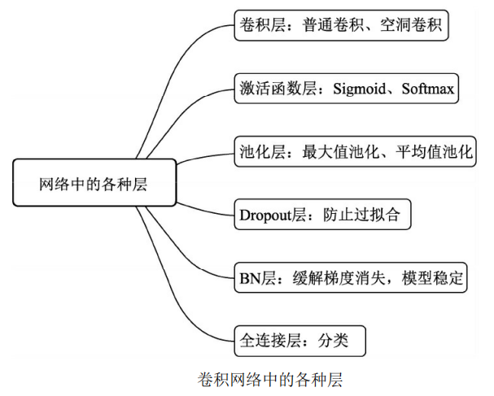
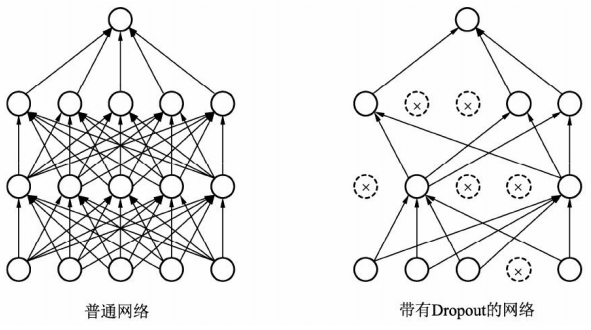

### 1. 卷积层、池化层和全连接层
关于卷积层、池化层和全连接层，可阅读：[CNN的基础(三大层)](docx\3.CNN的基础(三大层).md)

### 2. 激活函数层
激活函数层请看我的另外一篇文章:[常用激活函数的Pytorch实现](docx\2.常用激活函数的Pytorch实现.md)，想了解更详细具体的内容请看：[激活函数](docx\1.激活函数.md)

### 3. Dropout层
过拟合是很多深度学习乃至机器学习算法的通病。2012 年，Hinton等人提出了Dropout算法，可以比较有效地`缓解过拟合`现象的发生，起到一定正则化的效果。

Dropout的基本思想如下图所示，在训练时，`每个神经元以概率p保 留，即以1-p的概率停止工作，每次前向传播保留下来的神经元都不 同，这样可以使得模型不太依赖于某些局部特征，泛化性能更强`。在测试时，为了保证相同的输出期望值，每个参数还要乘以p。当然还有另 外一种计算方式称为Inverted Dropout，即在训练时将保留下的神经元乘 以1/p，这样测试时就不需要再改变权重。

